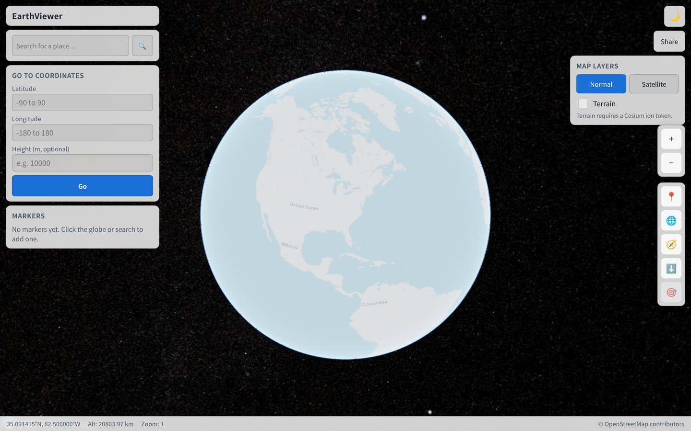

# EarthViewer

Browser-based 3D globe explorer built with **React**, **TypeScript**, **Vite**, and **CesiumJS**.

Rotate, zoom, and tilt the Earth; search places; jump by coordinates; drop markers; switch map layers; and share a camera view via URL. Designed for GitHub Pages at:

**https://rsasaki0109.github.io/earth-viewer/**

[](https://rsasaki0109.github.io/earth-viewer/)

## Features

- **3D globe** — free rotate / zoom / tilt (mouse + touch), responsive canvas, loading overlay
- **Current location** — Geolocation API on demand (never prompts on page load)
- **Place search** — OpenStreetMap Nominatim (debounced, cached, swappable provider)
- **Coordinate jump** — lat/lon (+ optional height), also via URL query params
- **Layers** — OSM map / Esri satellite imagery; Cesium World Terrain when an ion token is set
- **Info bar** — center lat/lon, camera altitude, zoom level, map attribution (FPS in dev only)
- **Markers** — click globe to add, list + detail panel, LocalStorage persistence
- **Camera presets** — whole earth, top-down, current location, selected marker, north-up
- **Share** — copy URL with lat, lon, height, heading, pitch (Clipboard API + fallbacks)
- **Themes** — light / dark, default from `prefers-color-scheme`

## Tech stack

| Area        | Choice                                      |
| ----------- | ------------------------------------------- |
| UI          | React 18 + TypeScript                       |
| Bundler     | Vite 5 + `vite-plugin-cesium`               |
| Globe       | CesiumJS                                    |
| Geocoding   | OpenStreetMap Nominatim                     |
| Style       | Plain CSS (theme variables)                 |
| Lint / test | ESLint, Vitest (jsdom)                      |
| Deploy      | GitHub Actions → GitHub Pages               |

## Local development

```bash
git clone https://github.com/rsasaki0109/earth-viewer.git
cd earth-viewer
npm install
npm run dev
```

Open the URL printed by Vite (usually `http://localhost:5173/earth-viewer/`).

### Scripts

| Command              | Description                          |
| -------------------- | ------------------------------------ |
| `npm run dev`        | Dev server with HMR                  |
| `npm run build`      | Typecheck + production build         |
| `npm run preview`    | Serve the production build locally   |
| `npm run lint`       | ESLint                               |
| `npm run typecheck`  | `tsc --noEmit`                       |
| `npm test`           | Vitest unit tests                    |

## Build

```bash
npm run build
```

Output is written to `dist/`. The Vite `base` defaults to `/earth-viewer/` so asset paths work under GitHub Pages project sites. Override if needed:

```bash
VITE_BASE=/ npm run build   # for root hosting
```

## GitHub Pages

1. Push `main` to GitHub (`rsasaki0109/earth-viewer`).
2. In the repo: **Settings → Pages → Source: GitHub Actions**.
3. The workflow [`.github/workflows/deploy.yml`](.github/workflows/deploy.yml) runs on every push to `main`:
   - `npm ci`
   - lint, typecheck, test, build (`VITE_BASE=/earth-viewer/`)
   - deploy the `dist/` artifact with `actions/deploy-pages`
4. Site URL: `https://rsasaki0109.github.io/earth-viewer/`

Optional: add a repository secret `VITE_CESIUM_ION_TOKEN` to enable Cesium World Terrain in production. The app still works without it (ellipsoid terrain only).

## Environment variables

Copy `.env.example` to `.env` for local use:

| Variable                 | Required | Description |
| ------------------------ | -------- | ----------- |
| `VITE_CESIUM_ION_TOKEN`  | No       | Cesium ion access token. Enables World Terrain. Leave empty for OSM + ellipsoid only. |
| `VITE_BASE`              | No       | Vite public base path. Defaults to `/earth-viewer/`. |

Do not commit real secrets. `.env` is gitignored.

## Map, imagery, and geocoding terms

| Source | Use | Attribution / terms |
| ------ | --- | ------------------- |
| [OpenStreetMap](https://www.openstreetmap.org/copyright) raster tiles | Default basemap | © OpenStreetMap contributors. Follow the [Tile Usage Policy](https://operations.osmfoundation.org/policies/tiles/). |
| [Esri World Imagery](https://www.arcgis.com/home/item.html?id=10df2279f9684e4a9f6a7f08febac2a9) | Satellite layer | Tiles © Esri — Source: Esri, Maxar, Earthstar Geographics, and the GIS User Community. |
| [Nominatim](https://nominatim.org/) | Place search | [Usage policy](https://operations.osmfoundation.org/policies/nominatim/) — keep request rate low (this app uses search-on-submit + debounce + cache). Provide a valid User-Agent via the browser. |
| [Cesium ion](https://cesium.com/platform/cesium-ion/) (optional) | World Terrain | Requires your own token and compliance with Cesium’s terms. |

Attribution is also shown in the bottom info bar (and Cesium’s credit container for layer credits).

## Copyright & attribution

- Application code: MIT (see [LICENSE](LICENSE)).
- CesiumJS: Apache-2.0 — see the Cesium project for details.
- Map data and imagery remain under their respective licenses (OSM, Esri, etc.).

## Limitations

- No server-side storage or multi-user sync; markers live in the browser’s LocalStorage.
- Satellite imagery and OSM tiles depend on third-party availability and fair-use policies.
- Terrain elevation requires a Cesium ion token; without it the globe is a smooth ellipsoid.
- Nominatim is a free community service — not for bulk geocoding.
- WebGL is required; very old GPUs or disabled hardware acceleration may fail.

## Future ideas

- KML / KMZ / GeoJSON import
- GPX tracks and GNSS / NMEA logs
- ROS bag–derived trajectories
- 3D Tiles and LiDAR point clouds
- Distance / area measurement and elevation profiles
- Time-of-day lighting
- Marker import / export
- Offline cache / PWA

## Contributing

Issues and pull requests are welcome.

1. Fork and create a feature branch.
2. Keep changes focused; prefer small PRs.
3. Run `npm run lint`, `npm run typecheck`, `npm test`, and `npm run build` before opening a PR.

## License

[MIT](LICENSE) © 2026 rsasaki0109
